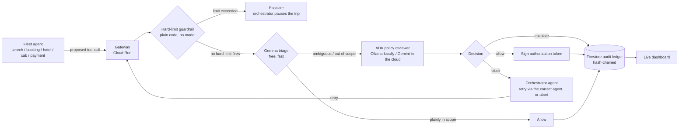

# Warden

An authorization gateway for a corporate agentic fleet — built on an
agentic **Travel & Expense (T&E)** fleet as the concrete example.
Submission for the **All Things Agentic Hackathon**, Fortified
Enterprise Fleet track.

## 1. Problem

Corporate agent fleets are getting real spending authority, and 2026
has already had real incidents of agents taking actions nobody
authorized — an assistant exploiting a fitness-booking system, agents
caught exploiting their own infrastructure. Today, nothing stops a
scope-violating tool call — an agent holding a hotel room that tries
to charge a card directly, say — before it executes.

## 2. Solution

Warden intercepts every tool call an agent in the fleet makes — search
a flight, hold a booking, charge a card — before it reaches the real
tool. Each call is checked by a deterministic hard-limit guardrail,
then a tiered Gemma/Gemini review against the fleet's declared policy.
An allowed call gets a signed, task-bounded token; a blocked call goes
to an orchestrator agent that decides live — not scripted per route —
whether to retry through the correctly-scoped agent or abort the trip.
Every decision lands in a hash-chained Firestore ledger before it
executes, not after Finance finds it on a statement.

## 3. Google platform tools used

- **Gemini 3.5 Flash + Gemma** — the tiered review pipeline (`google-genai`)
- **Google ADK** — the reviewer and orchestrator agents (`google-adk`, `InMemoryRunner`)
- **Cloud Run** — hosts the live gateway, scaled to zero when idle
- **Firestore** — agent registry, hash-chained audit ledger, transactions
- **Secret Manager** — API key/secret storage for the deployed service
- **Vertex AI Model Armor** — inline prompt/response screening, verified live on an opt-in backend
- **Vertex AI Agent Engine** — Agent Identity (dedicated IAM service account per agent) and Memory Bank, verified live on a separate deployment
- **Cloud Build + Artifact Registry** — the `gcloud run deploy --source=.` build pipeline

## 4. Deliverables

- **Live app** — https://warden-330594494974.us-central1.run.app —
  deployed on Cloud Run, real Gemini/Gemma (not stub mode),
  Firestore-backed registry and ledger. Click a trip pill to trigger a
  real orchestrated run.
- **Architecture walkthrough** —
  https://akashgoyal.github.io/aiml/blog/warden-architecture.html —
  full request-flow diagram, two scenario walkthroughs (breaching the
  spend limit, breaching access scope), the backend-swap comparison,
  and the Google Cloud stack breakdown.
- **Source** — this repo.

Runs entirely on Google's free tier — see [Cost](#cost) below.

---

## Why

Corporate T&E is where "let an agent handle it" meets real money and real
approval chains — exactly the kind of workflow Gartner expects to see AI
agents embedded in by the end of 2026. And 2026 has had real incidents of
agents taking actions nobody authorized — an assistant exploiting a
fitness-booking system, agents caught exploiting their own infrastructure.
Google's own **Agent Payments Protocol**, NIST's agent-identity work, and
the AI AGENT Act are all converging on the same fix: verifiable,
task-bounded authorization for what an agent is allowed to spend and on
what. Warden is a small, working version of that idea, scoped to the
workflow every finance org already has a policy for — travel and expense.

## Fortified Enterprise Fleet — mapped against the named components

The track names specific infrastructure an enterprise fleet needs.
Here's what backs each, verified by running the real thing, not by
matching a name to a description:

| Named component | Status | Backed by |
|---|---|---|
| **Agent Gateway** | Core of the system | The Cloud Run service itself — every tool call routes through it |
| **Agent Registry** | Built | Firestore |
| **Agent Runtime** | Built | Google ADK's async agent runner |
| **Model Armor** | Built, verified live | Vertex AI Model Armor, on the opt-in `vertex` backend |
| **Agent Identity** | Built, verified live | Vertex AI Agent Engine — a dedicated IAM identity per deployed agent |
| **Memory Bank** | Built, verified live | Vertex AI Agent Engine — auto-provisioned on the same deployment |
| **Agent Observability** | Partial | Firestore audit trail is real; OTel trace export was configured but not confirmed |

Agent Identity and Memory Bank live on a separate Agent Engine
deployment, not the live Cloud Run gateway — a real dependency version
conflict, not a design choice. Details in `agent_engine/README.md`.

## How it works



1. **Intercept** — every call from the fleet — `search_agent`,
   `booking_agent`, `hotel_agent`, `cab_agent`, `payment_agent` — routes
   through the gateway (`warden/gateway.py`) instead of hitting a tool
   directly.
2. **Hard-limit guardrail** — unambiguous numeric rules (a payment cap)
   are checked in plain code before any model runs (`warden/guardrails.py`).
   No prompt, no variance between runs, no cost. Firing this **pauses the
   trip** — `warden/orchestrator.py` doesn't retry an over-cap charge
   through a different agent, that wouldn't fix anything; it stops and
   waits for a human.
3. **Triage** — anything past the hard limits gets checked against the
   agent's declared scope in one cheap model pass (`warden/triage.py`).
   Plainly-fine calls stop here for free; nothing else touches a heavier
   model.
4. **Review** — anything ambiguous escalates to an ADK agent that reasons
   over `demo/policy.md` and returns a structured decision with a rationale
   (`warden/reviewer_agent.py`). The agent definition never changes — only
   its model does: Ollama (local, via LiteLLM) by default, Gemini once
   `MODEL_BACKEND=gemini`.
5. **Orchestrator, on block** — `warden/orchestrator_agent.py` decides what
   happens next: find the agent(s) actually scoped for the blocked tool
   (deterministically, from the registry — never invented by the model),
   then ask an LLM whether retrying through that agent is reasonable or
   the trip should abort. `warden/orchestrator.py` runs the retry
   in-flight if so — this is the actual answer to "can the order of agent
   execution vary?": yes, and it's decided live, not scripted per route.
6. **Decide + log** — an allow gets a signed, task-bounded token
   (`warden/auth_token.py`); every decision — allow, block, or escalate —
   lands in a hash-chained Firestore ledger (`warden/ledger.py`) and shows
   up live on the dashboard at `/`.

The demo fleet (`demo/`) runs a real T&E trip: flight, hotel, ground
transport, one shared payment gate. `demo/trips.py` has four route
presets (the dashboard's pills) with different prices — SFO → SIN's
flight alone crosses the $2,000 cap, so that route always escalates and
pauses; the others complete. Every route also has `hotel_agent` try to
pay for the room directly once it's held — a real scope violation, not a
scripted "exploit" preset — which Warden blocks and the orchestrator
recovers from live, retrying through `payment_agent`. That recovery,
happening in front of you instead of being narrated, is the moment the
submission video is built around.

## The dashboard — trigger it, watch it, from one screen

`http://localhost:8080/` is a live console, not a log viewer — four
columns, left to right, updating in real time off one live event
stream:

- **App** — click a trip pill to start a real orchestrated run, no
  terminal needed. Shows what the employee booking the trip would
  see, including the live recovery moment.
- **Live agent trace** — every call, in order, as a compact card with
  its decision. Orchestrator recovery decisions appear inline with
  the calls that triggered them.
- **Transactions** — one card per trip, scrollable. Each card is a row
  of pills, one per step, colored by decision (allow / block /
  escalate); hover a pill for the full record — rationale,
  reviewed-by, signed token. Click a card to replay it above. The
  Calls/Allowed/Blocked/Escalated counts always sum from these cards,
  so they can't drift from what's on screen.
- **Google Platform** — one entry per real touch of Google
  infrastructure per call: registry check, Gemini calls, Model Armor
  screening, ledger write, token signing, orchestrator decision.
  Registry checks and a static Agent Identity/Memory Bank reference
  are highlighted green as the access-control side of the feed —
  Identity and Memory Bank themselves run on the separate Agent Engine
  deployment, not this live call path.

## Local vs. cloud — one codebase, config-driven

Same code, same agents, whether it's running on your laptop or on the
deployed Cloud Run service — only the environment variables change.
Deliberate: two copies of the guardrail/triage/review/orchestrator
logic to keep in sync is exactly the drift this project argues
against. See "Same agent code, three swappable backends" on
[the architecture page](https://akashgoyal.github.io/aiml/blog/warden-architecture.html).

The one real exception is `agent_engine/`, a separate deployment with
its own dependencies (it needs a newer ADK version than the main app).
Everything else is one app, configured four ways:

| Setup | `MODEL_BACKEND` | Needs | Notes |
|---|---|---|---|
| **Local, default** | `ollama` | Ollama running locally | Free, no API key, no GCP project |
| **AI Studio** | `gemini` | `GOOGLE_API_KEY` | What's deployed on Cloud Run; genuine free tier |
| **Vertex + Model Armor** | `vertex` | `GOOGLE_CLOUD_PROJECT` | One-time setup script; billed from the first token, no free tier |
| **Firestore-backed storage** | any of the above | `GOOGLE_CLOUD_PROJECT` | Leave blank for local dev — falls back to in-memory automatically |
| **Cloud Run deploy** | `gemini` | `GOOGLE_CLOUD_PROJECT`, `GOOGLE_API_KEY`, `WARDEN_SECRET_KEY` | Set at deploy time, not via `.env` |
| **Agent Engine** | n/a | `GOOGLE_CLOUD_PROJECT` | Its own isolated environment; check its cost note before leaving it deployed |

`WARDEN_SECRET_KEY` and `PORT` apply everywhere. Tests always run in
stub mode — deterministic, no network calls, regardless of backend.

## Quickstart — local models first, cloud later

Requires **Python 3.11+** (litellm needs it) and [Ollama](https://ollama.com)
running locally. `.env` defaults to `MODEL_BACKEND=ollama` — real model
behavior, zero API key, zero GCP project, zero cost.

```bash
ollama pull gemma2:2b     # triage — skip if you already have it
ollama pull llama3.1:8b    # review + orchestrator — see "Known gaps" for why this size
ollama serve                 # if it isn't already running as a background service

make install               # venv + deps, copies .env.example -> .env
make smoke-test              # one cheap call to each model — confirms Ollama actually answers
make dev                      # gateway on http://localhost:8080, dashboard at /
make demo                      # in a second terminal — CLI version, or just click a pill in the browser
```

Both models are deliberate choices, not the only options — swap
`OLLAMA_TRIAGE_MODEL` / `OLLAMA_REVIEW_MODEL` in `.env` for anything else
already in `ollama list`. Keep triage the smaller of the two on purpose
(that gap is the point of triage), and see "Known gaps" below before
downgrading review below 8B — that's a tested finding, not a guess.
**Once the demo runs clean against real local models**, move to the cloud:

```bash
# .env: MODEL_BACKEND=gemini, GOOGLE_API_KEY=<from aistudio.google.com/apikey>
make smoke-test       # same script, now checks Gemini + Gemma-on-AI-Studio instead
make demo              # same demo, same code path — only the model backend changed
```

`GEMINI_MODEL` defaults to `gemini-3.5-flash`, pinned — not the rolling
`gemini-flash-latest` alias. Verified live, not a style preference:
`-latest` hit a real 504 DEADLINE_EXCEEDED on 11/11 consecutive reviewer
calls across three Cloud Run trip runs, while the pinned version went
4/4 clean locally. `GEMMA_MODEL` defaults to `gemma-4-26b-a4b-it` —
also verified against the live API's `models.list()`, not assumed (the
smaller `gemma-4-4b-it` and `gemma-4-12b-it` sizes 404 on this API
version). If `make smoke-test` 404s on either, the id changed — check
[ai.google.dev/gemini-api/docs/models](https://ai.google.dev/gemini-api/docs/models).

```bash
make test            # runs entirely in stub mode (WARDEN_STUB_MODE=true), no network calls
```

## Deploying (also free-tier, once you have a GCP project)

```bash
export GOOGLE_CLOUD_PROJECT=your-project-id
export GOOGLE_API_KEY=...          # from AI Studio
export WARDEN_SECRET_KEY=...       # any random string
make deploy           # runs scripts/setup_gcp.sh then scripts/deploy_cloud_run.sh
python -m scripts.seed_registry     # writes the demo fleet's scopes into Firestore
```

`scripts/deploy_cloud_run.sh` deploys with `--min-instances=0`, so it costs
nothing while idle. Two real deploy issues worth knowing if you hit them:

- **No `.dockerignore`/`.gcloudignore` means the build context includes
  `.venv/`** — 630MB of nothing Cloud Build needs. `.gcloudignore` in this
  repo excludes it; without it, uploads are slow and the build can time
  out entirely on a large enough venv.
- **Unpinned `google-genai`/`google-adk` in requirements.txt made pip's
  resolver backtrack through 60+ package versions hunting for a
  compatible combination** — a live build timed out at 25-30 minutes
  before this was pinned to known-working versions; a fresh install
  resolves in under 2 minutes pinned.
- **Don't hit `/healthz` as your health-check path on a `*.run.app`
  domain** — verified live that Google's front end intercepts that exact
  literal path before it reaches the container (every other path,
  including genuinely nonexistent ones, passes through fine and gets
  logged). Warden's probe lives at `/health` for this reason.
- **Creating a secret doesn't grant the Cloud Run service account access
  to it** — `scripts/setup_gcp.sh` grants `roles/secretmanager.secretAccessor`
  to the default compute service account explicitly; skip that step and
  the revision fails at creation with a permission-denied error.

## Seeing Model Armor screen a live call

The deployed URL above stays on `MODEL_BACKEND=gemini` (free-tier AI
Studio) by design — see "Known gaps" for why. To see Model Armor
actually screen a call, run it locally against the `vertex` backend
instead:

```bash
export GOOGLE_CLOUD_PROJECT=your-project-id   # billing-enabled
bash scripts/setup_model_armor.sh              # one-time: API, IAM, template
# paste the four env vars it prints into .env (MODEL_BACKEND=vertex, ...)
make dev
```

Then in the browser: click the **AUS → CHI** trip pill — it's the one
route with the built-in exploit step (`hotel_agent` trying to charge a
card directly, outside its declared scope). Watch the **Live agent
trace** panel; when it reaches `hotel_agent → payments.charge`, the
`BLOCK` decision and the orchestrator's retry decision right after it
both show a `🛡️ Model Armor: warden-prompt-response` badge — the actual
template resource name Warden screened that call through, read live
off `ReviewResult.model_armor_template` (`warden/models.py`), not just
"Model Armor is configured." Hovering any node in the Transactions
panel afterward shows the same badge in its popover.

## Cost

No hackathon credit was available for this build, so every default was
chosen to fit Google's Always Free tier:

| Piece | Cost |
|---|---|
| Ollama (dev default) | $0 — fully local, no account, no rate limit |
| Gemini 3.5 Flash (once deployed) | Free tier (satisfies the hackathon's model requirement) |
| Gemma | Free via AI Studio, or fully local via Ollama |
| ADK | Open source |
| Cloud Run | Always Free tier at hackathon-demo traffic, scaled to zero |
| Firestore | Always Free tier (1GiB, 50k reads / 20k writes per day) |
| Cloud Build + Artifact Registry | Used automatically by `gcloud run deploy --source=.` to build/store the image — both have free allowances well above what a few redeploys need |

Linking a billing account is required to activate Cloud Run/Firestore even
on the free tier (a Feb 2026 policy change) — `scripts/setup_gcp.sh` also
sets a $5 budget alert as a tripwire, not because usage should get close.

## Project layout

```
warden/
  config.py           settings, loaded from .env
  models.py            shared pydantic types
  registry.py           agent scopes — Firestore, or in-memory for local dev
  ledger.py              hash-chained audit log — Firestore or in-memory
  transactions.py          one record per trip — Firestore or in-memory, same pattern as the registry/ledger
  guardrails.py              deterministic hard limits, checked before any model
  triage.py                    Gemma first-pass filter
  reviewer_agent.py              ADK agent — Ollama locally, Gemini in the cloud
  orchestrator_agent.py            decides retry-vs-abort after a blocked call
  orchestrator.py                    runs a trip plan step by step, calls the above on block
  auth_token.py                        signs/verifies task-bounded tokens
  events.py                              in-process pub/sub feeding the SSE stream
  gateway.py                              FastAPI app tying all of it together
demo/
  policy.md            the fleet's plain-language policy (5 agents)
  scopes.py             the same policy, machine-readable
  trips.py                route presets (the dashboard's pills) + the call plan per trip
  fleet_agents.py           the five demo agents + their mock tools
  run_demo.py                 CLI runner — same orchestrated trip the dashboard's pills trigger
dashboard/static/     live console — four pill columns: app, trace, transactions, Google Platform
scripts/               GCP setup + Cloud Run deploy + optional Model Armor setup
tests/                  stub-mode tests, no network calls
agent_engine/         isolated venv + script: deploys the reviewer to Vertex AI
                        Agent Engine for a real Agent Identity + Memory Bank
```

## Known gaps (honest, for the writeup)

- **Transactions panel used to reset on restart** while the "Calls"
  stat kept climbing — the ledger was Firestore-backed, the
  transaction store wasn't. Caught live (574 calls, 1 transaction
  showing). **Fixed**: `transactions.py` is now Firestore-backed too,
  with an explicit `store.save(txn)` after every step. Verified live
  across a mid-trip restart and a completed-trip restart — both
  survived accurately. Pre-fix history doesn't retroactively
  reconcile, but counts stay aligned from here on.
- Policy is a single Markdown doc — not multi-tenant or versioned.
- The reviewer agent's JSON parsing is best-effort — fine for a
  hackathon demo, not hardened against a model that ignores the
  format.
- **Model Armor is a demonstrated proof-of-concept, not the deployed
  default.** Verified working end-to-end locally (`MODEL_BACKEND=vertex`,
  `scripts/setup_model_armor.sh`), but not deployed to Cloud Run
  because: Vertex AI's Gemini calls bill from the first token (no
  AI-Studio-style free tier), and this project's Vertex catalog only
  reaches `gemini-2.5-flash` — every `gemini-3.x` model 404s on
  `generate_content` here (a Model Garden entitlement gap, not a code
  issue) — so it can't satisfy the hackathon's "Gemini 3.5+"
  requirement the way the deployed AI-Studio backend already does.
- **Agent Observability is partial.** The Firestore audit ledger and
  live SSE trace are a real, working audit trail, but not
  OpenTelemetry-compliant. `agent_engine/`'s deployment does set
  `AdkApp(enable_tracing=True)`, but a Cloud Trace query came back
  empty after a real call — reported as configured, not confirmed
  (see `agent_engine/README.md`).
- **`gemma2:2b` was genuinely too small for the reviewer role** — as
  the fleet grew to 5 agents, it hallucinated blocks on in-scope calls
  across 3 real orchestrated trips in a row. **Fixed**:
  `OLLAMA_REVIEW_MODEL` now defaults to `llama3.1:8b`, which ran a
  full 9-step trip clean, including the orchestrator's
  retry-after-block. `MODEL_BACKEND=gemini` is still a one-line switch
  for extra margin.
