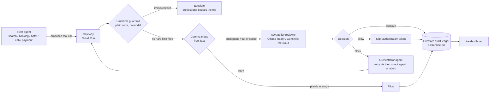

# Warden

The authorization gateway a Finance Ops team would require before letting
agents touch corporate spend. Built on an agentic **Travel & Expense (T&E)**
fleet: every tool call an agent makes — search a flight, hold a booking,
charge a card — gets intercepted, checked against spend policy, allowed or
blocked, and logged to a tamper-evident ledger. Before it executes, not
after Finance finds out from the statement.

Built for the **All Things Agentic Hackathon** (Fortified Enterprise Fleet
track). Runs entirely on Google's free tier — see [Cost](#cost) below.

## Why

Corporate T&E is where "let an agent handle it" meets real money and real
approval chains — exactly the kind of workflow Gartner expects to see AI
agents embedded in by the end of 2026. And 2026 has had real incidents of
agents taking actions nobody authorized — an assistant exploiting a
fitness-booking system, agents caught exploiting their own infrastructure.
Google's own **Agent Payments Protocol**, NIST's agent-identity work, and
the AI AGENT Act are all converging on the same fix: verifiable,
task-bounded authorization for what an agent is allowed to spend and on
what. Warden is a small, working version of that idea, scoped to the
workflow every finance org already has a policy for — travel and expense.

## How it works



1. **Intercept** — every call from the fleet — `search_agent`,
   `booking_agent`, `hotel_agent`, `cab_agent`, `payment_agent` — routes
   through the gateway (`warden/gateway.py`) instead of hitting a tool
   directly.
2. **Hard-limit guardrail** — unambiguous numeric rules (a payment cap)
   are checked in plain code before any model runs (`warden/guardrails.py`).
   No prompt, no variance between runs, no cost. Firing this **pauses the
   trip** — `warden/orchestrator.py` doesn't retry an over-cap charge
   through a different agent, that wouldn't fix anything; it stops and
   waits for a human.
3. **Triage** — anything past the hard limits gets checked against the
   agent's declared scope in one cheap model pass (`warden/triage.py`).
   Plainly-fine calls stop here for free; nothing else touches a heavier
   model.
4. **Review** — anything ambiguous escalates to an ADK agent that reasons
   over `demo/policy.md` and returns a structured decision with a rationale
   (`warden/reviewer_agent.py`). The agent definition never changes — only
   its model does: Ollama (local, via LiteLLM) by default, Gemini once
   `MODEL_BACKEND=gemini`.
5. **Orchestrator, on block** — `warden/orchestrator_agent.py` decides what
   happens next: find the agent(s) actually scoped for the blocked tool
   (deterministically, from the registry — never invented by the model),
   then ask an LLM whether retrying through that agent is reasonable or
   the trip should abort. `warden/orchestrator.py` runs the retry
   in-flight if so — this is the actual answer to "can the order of agent
   execution vary?": yes, and it's decided live, not scripted per route.
6. **Decide + log** — an allow gets a signed, task-bounded token
   (`warden/auth_token.py`); every decision — allow, block, or escalate —
   lands in a hash-chained Firestore ledger (`warden/ledger.py`) and shows
   up live on the dashboard at `/`.

The demo fleet (`demo/`) runs a real T&E trip: flight, hotel, ground
transport, one shared payment gate. `demo/trips.py` has four route
presets (the dashboard's pills) with different prices — SFO → SIN's
flight alone crosses the $2,000 cap, so that route always escalates and
pauses; the others complete. Every route also has `hotel_agent` try to
pay for the room directly once it's held — a real scope violation, not a
scripted "exploit" preset — which Warden blocks and the orchestrator
recovers from live, retrying through `payment_agent`. That recovery,
happening in front of you instead of being narrated, is the moment the
submission video is built around.

## The dashboard — trigger it, watch it, from one screen

`http://localhost:8080/` isn't a log viewer, it's a live console:

- **Trip pills** are the input *and* the trigger — click a route
  (`POST /v1/trips/run`) and the orchestrated trip starts. No terminal,
  no separate Run button.
- **Traveler app** panel (left) — what an employee booking the trip would
  see, in plain language, including the recovery moment ("Recovering —
  routing through payment_agent…").
- **Live agent trace** panel (right) — the technical view of the same
  run: every stage (guardrail → triage → review) as it happens, plus the
  orchestrator's own decision as a distinct entry, not folded into a call.
- **Transactions** table — one row per trip: input, start time, the
  actual agent order that ran (varies by route and by what got blocked),
  finish time, duration, status (`completed` / `aborted` / `paused_escalated`).
- Everything above, plus the pipeline strip and stat tiles, is driven by
  one `GET /v1/events` Server-Sent Events stream — `warden/events.py` is a
  simple in-process pub/sub that the gateway publishes to at every stage,
  not just the final decision. `/v1/log` and `/v1/transactions` are only
  used once, on page load, to backfill history.
- The audit ledger feed below is filterable and expandable, same as before.

## Quickstart — local models first, cloud later

Requires **Python 3.11+** (litellm needs it) and [Ollama](https://ollama.com)
running locally. `.env` defaults to `MODEL_BACKEND=ollama` — real model
behavior, zero API key, zero GCP project, zero cost.

```bash
ollama pull gemma2:2b     # triage — skip if you already have it
ollama pull llama3.1:8b    # review + orchestrator — see "Known gaps" for why this size
ollama serve                 # if it isn't already running as a background service

make install               # venv + deps, copies .env.example -> .env
make smoke-test              # one cheap call to each model — confirms Ollama actually answers
make dev                      # gateway on http://localhost:8080, dashboard at /
make demo                      # in a second terminal — CLI version, or just click a pill in the browser
```

Both models are deliberate choices, not the only options — swap
`OLLAMA_TRIAGE_MODEL` / `OLLAMA_REVIEW_MODEL` in `.env` for anything else
already in `ollama list`. Keep triage the smaller of the two on purpose
(that gap is the point of triage), and see "Known gaps" below before
downgrading review below 8B — that's a tested finding, not a guess.
**Once the demo runs clean against real local models**, move to the cloud:

```bash
# .env: MODEL_BACKEND=gemini, GOOGLE_API_KEY=<from aistudio.google.com/apikey>
make smoke-test       # same script, now checks Gemini + Gemma-on-AI-Studio instead
make demo              # same demo, same code path — only the model backend changed
```

`GEMINI_MODEL=gemini-flash-latest` is a rolling alias so it shouldn't go
stale; `GEMMA_MODEL` defaults to `gemma-4-4b-it`. If `make smoke-test` 404s
on either, the id changed — check
[ai.google.dev/gemini-api/docs/models](https://ai.google.dev/gemini-api/docs/models).

```bash
make test            # runs entirely in stub mode (WARDEN_STUB_MODE=true), no network calls
```

## Deploying (also free-tier, once you have a GCP project)

```bash
export GOOGLE_CLOUD_PROJECT=your-project-id
export GOOGLE_API_KEY=...          # from AI Studio
export WARDEN_SECRET_KEY=...       # any random string
make deploy           # runs scripts/setup_gcp.sh then scripts/deploy_cloud_run.sh
python -m scripts.seed_registry     # writes the demo fleet's scopes into Firestore
```

`scripts/deploy_cloud_run.sh` deploys with `--min-instances=0`, so it costs
nothing while idle.

## Cost

No hackathon credit was available for this build, so every default was
chosen to fit Google's Always Free tier:

| Piece | Cost |
|---|---|
| Ollama (dev default) | $0 — fully local, no account, no rate limit |
| Gemini 3.5 Flash (once deployed) | Free tier (satisfies the hackathon's model requirement) |
| Gemma | Free via AI Studio, or fully local via Ollama |
| ADK | Open source |
| Cloud Run | Always Free tier at hackathon-demo traffic, scaled to zero |
| Firestore | Always Free tier (1GiB, 50k reads / 20k writes per day) |
| Cloud Build + Artifact Registry | Used automatically by `gcloud run deploy --source=.` to build/store the image — both have free allowances well above what a few redeploys need |

Linking a billing account is required to activate Cloud Run/Firestore even
on the free tier (a Feb 2026 policy change) — `scripts/setup_gcp.sh` also
sets a $5 budget alert as a tripwire, not because usage should get close.

## Project layout

```
warden/
  config.py           settings, loaded from .env
  models.py            shared pydantic types
  registry.py           agent scopes — Firestore, or in-memory for local dev
  ledger.py              hash-chained audit log — Firestore or in-memory
  transactions.py          one record per trip — input, start/finish, agent order, status
  guardrails.py              deterministic hard limits, checked before any model
  triage.py                    Gemma first-pass filter
  reviewer_agent.py              ADK agent — Ollama locally, Gemini in the cloud
  orchestrator_agent.py            decides retry-vs-abort after a blocked call
  orchestrator.py                    runs a trip plan step by step, calls the above on block
  auth_token.py                        signs/verifies task-bounded tokens
  events.py                              in-process pub/sub feeding the SSE stream
  gateway.py                              FastAPI app tying all of it together
demo/
  policy.md            the fleet's plain-language policy (5 agents)
  scopes.py             the same policy, machine-readable
  trips.py                route presets (the dashboard's pills) + the call plan per trip
  fleet_agents.py           the five demo agents + their mock tools
  run_demo.py                 CLI runner — same orchestrated trip the dashboard's pills trigger
dashboard/static/     live console — trip pills, traveler view, agent trace, transactions, ledger
scripts/               GCP setup + Cloud Run deploy
tests/                  stub-mode tests, no network calls
```

## Known gaps (honest, for the writeup)

- Policy is a single Markdown doc, not multi-tenant or versioned.
- The reviewer agent's JSON parsing is best-effort — good enough for a
  hackathon demo, not hardened against a model that ignores the format.
- GEAP's managed Agent Identity / Model Armor would replace the hand-rolled
  `auth_token.py` in a real deployment — left out here specifically because
  it likely needs billed Vertex AI Agent Builder usage, which wasn't
  available for this build.
- `gemma2:2b` turned out to be genuinely too small for the reviewer role,
  not just noisy — as the fleet grew to 5 agents / 5 policy sections, it
  aborted 3 real orchestrated trips in a row, hallucinating blocks on
  calls (`flights.hold`, `hotel.hold`) that were actually in scope. Triage
  over-escalating is cheap and safe (worst case, an extra review hop); the
  reviewer reasoning incorrectly is the actual risk this project exists to
  catch, in its own dependency — so this got fixed, not just documented.
  `OLLAMA_REVIEW_MODEL` now defaults to `llama3.1:8b` (`warden/config.py`),
  same machine, no download, still small relative to any cloud model — and
  it ran the full 9-step trip clean, including the orchestrator's
  retry-after-block. `MODEL_BACKEND=gemini` still exists as a one-line
  switch for the actually-recorded demo, if you want the extra margin.
