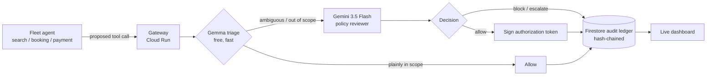

# Warden

A task-bounded authorization gateway for multi-agent fleets. Every tool call
an agent makes gets intercepted, reviewed, allowed or blocked, and logged to
a tamper-evident ledger — before it executes, not after something goes wrong.

Built for the **All Things Agentic Hackathon** (Fortified Enterprise Fleet
track). Runs entirely on Google's free tier — see [Cost](#cost) below.

## Why

2026 has had real incidents of agents taking actions nobody authorized — an
assistant exploiting a fitness-booking system, agents caught exploiting their
own infrastructure. Google's Agent Payments Protocol, NIST's agent-identity
work, and the AI AGENT Act are all converging on the same fix: verifiable,
task-bounded authorization for what an agent is allowed to do. Warden is a
small, working version of that idea.

## How it works



1. **Intercept** — every call from `search_agent`, `booking_agent`, or
   `payment_agent` routes through the gateway (`warden/gateway.py`) instead
   of hitting a tool directly.
2. **Triage** — Gemma checks the call against the agent's declared scope in
   one cheap pass (`warden/triage.py`). Plainly-fine calls stop here for
   free; nothing else touches a paid-tier-adjacent model.
3. **Review** — anything ambiguous escalates to an ADK agent backed by
   Gemini 3.5 Flash, which reasons over `demo/policy.md` and returns a
   structured decision with a rationale (`warden/reviewer_agent.py`).
4. **Decide + log** — an allow gets a signed, task-bounded token
   (`warden/auth_token.py`); every decision — allow, block, or escalate —
   lands in a hash-chained Firestore ledger (`warden/ledger.py`) and shows
   up live on the dashboard at `/`.

The demo fleet (`demo/`) runs a normal booking flow, then has
`booking_agent` try to charge a payment directly — a call outside its
declared scope, mirroring the real 2026 incident pattern. Warden blocks it
live. That's the moment the submission video is built around.

## Quickstart (local, zero cost, zero setup)

```bash
make install        # venv + deps, copies .env.example -> .env
make dev             # gateway on http://localhost:8080, dashboard at /
make demo            # in a second terminal — runs the happy path + exploit
```

`.env` ships with `WARDEN_STUB_MODE=true`, so this all works with **no API
key and no GCP project** — triage and review use deterministic stand-ins.
Once you've got a free key from [aistudio.google.com/apikey](https://aistudio.google.com/apikey):

```bash
# .env: set GOOGLE_API_KEY, then WARDEN_STUB_MODE=false
make smoke-test       # one cheap call to each model — confirms key + model ids work
make demo              # now runs against the real Gemma triage + Gemini reviewer
```

Model ids move fast. `GEMINI_MODEL=gemini-flash-latest` is a rolling alias so
it shouldn't go stale. `GEMMA_MODEL` defaults to `gemma-4-4b-it` — Gemma 4's
smallest size, deliberately: triage should be the cheapest model that still
works, not the strongest one. If `make smoke-test` 404s on either, the id
changed — check [ai.google.dev/gemini-api/docs/models](https://ai.google.dev/gemini-api/docs/models).

```bash
make test            # runs entirely in stub mode, no network calls
```

## Deploying (also free-tier, once you have a GCP project)

```bash
export GOOGLE_CLOUD_PROJECT=your-project-id
export GOOGLE_API_KEY=...          # from AI Studio
export WARDEN_SECRET_KEY=...       # any random string
make deploy           # runs scripts/setup_gcp.sh then scripts/deploy_cloud_run.sh
python -m scripts.seed_registry     # writes the demo fleet's scopes into Firestore
```

`scripts/deploy_cloud_run.sh` deploys with `--min-instances=0`, so it costs
nothing while idle.

## Cost

No hackathon credit was available for this build, so every default was
chosen to fit Google's Always Free tier:

| Piece | Cost |
|---|---|
| Gemini 3.5 Flash | Free tier (satisfies the hackathon's model requirement) |
| Gemma | Free via AI Studio, or run fully locally |
| ADK | Open source |
| Cloud Run | Always Free tier at hackathon-demo traffic, scaled to zero |
| Firestore | Always Free tier (1GiB, 50k reads / 20k writes per day) |

Linking a billing account is required to activate Cloud Run/Firestore even
on the free tier (a Feb 2026 policy change) — `scripts/setup_gcp.sh` also
sets a $5 budget alert as a tripwire, not because usage should get close.

## Project layout

```
warden/
  config.py           settings, loaded from .env
  models.py            shared pydantic types
  registry.py           agent scopes — Firestore, or in-memory for local dev
  ledger.py              hash-chained audit log — Firestore or in-memory
  triage.py                Gemma first-pass filter
  reviewer_agent.py         ADK agent + Gemini 3.5 Flash policy review
  auth_token.py               signs/verifies task-bounded tokens
  gateway.py                    FastAPI app tying it together
demo/
  policy.md            the fleet's plain-language policy
  scopes.py             the same policy, machine-readable
  fleet_agents.py         the three demo agents + their tools
  run_demo.py               the exact script the video records
dashboard/static/     live log viewer served at /
scripts/               GCP setup + Cloud Run deploy
tests/                  stub-mode tests, no network calls
```

## Known gaps (honest, for the writeup)

- Policy is a single Markdown doc, not multi-tenant or versioned.
- The reviewer agent's JSON parsing is best-effort — good enough for a
  hackathon demo, not hardened against a model that ignores the format.
- GEAP's managed Agent Identity / Model Armor would replace the hand-rolled
  `auth_token.py` in a real deployment — left out here specifically because
  it likely needs billed Vertex AI Agent Builder usage, which wasn't
  available for this build.
