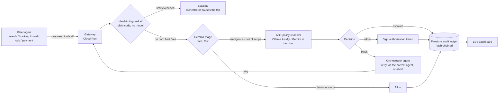

# Warden

The authorization gateway a Finance Ops team would require before letting
agents touch corporate spend. Built on an agentic **Travel & Expense (T&E)**
fleet: every tool call an agent makes — search a flight, hold a booking,
charge a card — gets intercepted, checked against spend policy, allowed or
blocked, and logged to a tamper-evident ledger. Before it executes, not
after Finance finds out from the statement.

Built for the **All Things Agentic Hackathon** (Fortified Enterprise Fleet
track). Runs entirely on Google's free tier — see [Cost](#cost) below.

**Live**: https://warden-330594494974.us-central1.run.app — deployed on
Cloud Run, backed by real Gemini/Gemma (not stub mode), Firestore-backed
registry and ledger. Click a trip pill to trigger a real orchestrated run.

## Why

Corporate T&E is where "let an agent handle it" meets real money and real
approval chains — exactly the kind of workflow Gartner expects to see AI
agents embedded in by the end of 2026. And 2026 has had real incidents of
agents taking actions nobody authorized — an assistant exploiting a
fitness-booking system, agents caught exploiting their own infrastructure.
Google's own **Agent Payments Protocol**, NIST's agent-identity work, and
the AI AGENT Act are all converging on the same fix: verifiable,
task-bounded authorization for what an agent is allowed to spend and on
what. Warden is a small, working version of that idea, scoped to the
workflow every finance org already has a policy for — travel and expense.

## How it works



1. **Intercept** — every call from the fleet — `search_agent`,
   `booking_agent`, `hotel_agent`, `cab_agent`, `payment_agent` — routes
   through the gateway (`warden/gateway.py`) instead of hitting a tool
   directly.
2. **Hard-limit guardrail** — unambiguous numeric rules (a payment cap)
   are checked in plain code before any model runs (`warden/guardrails.py`).
   No prompt, no variance between runs, no cost. Firing this **pauses the
   trip** — `warden/orchestrator.py` doesn't retry an over-cap charge
   through a different agent, that wouldn't fix anything; it stops and
   waits for a human.
3. **Triage** — anything past the hard limits gets checked against the
   agent's declared scope in one cheap model pass (`warden/triage.py`).
   Plainly-fine calls stop here for free; nothing else touches a heavier
   model.
4. **Review** — anything ambiguous escalates to an ADK agent that reasons
   over `demo/policy.md` and returns a structured decision with a rationale
   (`warden/reviewer_agent.py`). The agent definition never changes — only
   its model does: Ollama (local, via LiteLLM) by default, Gemini once
   `MODEL_BACKEND=gemini`.
5. **Orchestrator, on block** — `warden/orchestrator_agent.py` decides what
   happens next: find the agent(s) actually scoped for the blocked tool
   (deterministically, from the registry — never invented by the model),
   then ask an LLM whether retrying through that agent is reasonable or
   the trip should abort. `warden/orchestrator.py` runs the retry
   in-flight if so — this is the actual answer to "can the order of agent
   execution vary?": yes, and it's decided live, not scripted per route.
6. **Decide + log** — an allow gets a signed, task-bounded token
   (`warden/auth_token.py`); every decision — allow, block, or escalate —
   lands in a hash-chained Firestore ledger (`warden/ledger.py`) and shows
   up live on the dashboard at `/`.

The demo fleet (`demo/`) runs a real T&E trip: flight, hotel, ground
transport, one shared payment gate. `demo/trips.py` has four route
presets (the dashboard's pills) with different prices — SFO → SIN's
flight alone crosses the $2,000 cap, so that route always escalates and
pauses; the others complete. Every route also has `hotel_agent` try to
pay for the room directly once it's held — a real scope violation, not a
scripted "exploit" preset — which Warden blocks and the orchestrator
recovers from live, retrying through `payment_agent`. That recovery,
happening in front of you instead of being narrated, is the moment the
submission video is built around.

## The dashboard — trigger it, watch it, from one screen

`http://localhost:8080/` isn't a log viewer, it's a live console:

Three columns, three palettes on purpose — each scoped the same way
(override the CSS custom properties on the container, every component
underneath just re-tokens automatically): a warm light traveler-facing
rail, a neutral-dark live trace, and a cool-navy transactions panel with
its own blue accent, so the two dark columns still read as genuinely
different zones instead of blending into one continuous surface. Semantic
colors (allow/block/escalate) stay consistent everywhere — only the
ground and the accent shift per zone.

- **Left — Traveler app**, flush to the edge. **Trip pills are the input
  *and* the trigger** — click a route (`POST /v1/trips/run`) and the
  orchestrated trip starts, no terminal needed. Below the pills: what an
  employee booking the trip would see, in plain language, including the
  recovery moment ("Recovering — routing through payment_agent…").
- **Center — pipeline strip + Live agent trace**: every stage (guardrail
  → triage → review) as it happens, plus the orchestrator's own decision
  as a distinct entry, not folded into a call.
- **Right — stats + Transactions**, one card per trip. The agent order on
  each card is a linked list, not plain text — one named pill per executed
  step (the actual agent name, not an abstract dot), in the order it
  actually ran, colored by its own decision (green allow / red block /
  violet escalate, a distinct diamond pill for an orchestrator decision).
  **Hover one pill** to see that step's full content — agent, tool,
  decision, the actual call args (amounts, IDs, whatever it was called
  with), rationale, reviewed-by, a copyable signed token — in a floating
  popover, read from the persisted `TransactionStep` record. Hover a
  different pill, see a different agent; nothing else on the card changes
  state, which is the point — inspect one agent at a time, not the whole
  trip at once. A transaction that finishes mid-session gets its steps
  refetched from the backend rather than trusted to whatever was pieced
  together live, so hovering never shows a stale or partial reconstruction.
  **Clicking** the card (not a pill) replays the
  whole trip in the center trace panel instead, for the fuller view;
  "← Back to live" returns to the current run, and starting a new trip
  does the same automatically. The filter tabs (All/Allow/Block/Escalate)
  don't hide cards — they highlight the matching pills across every card
  and dim the rest, so you can spot every blocked step in a session at a
  glance without losing the trip context each one happened in.
- Everything above is driven by one `GET /v1/events` Server-Sent Events
  stream — `warden/events.py` is a simple in-process pub/sub that the
  gateway publishes to at every stage, not just the final decision.
  `/v1/log` and `/v1/transactions` are only used once, on page load, to
  backfill history.

## Quickstart — local models first, cloud later

Requires **Python 3.11+** (litellm needs it) and [Ollama](https://ollama.com)
running locally. `.env` defaults to `MODEL_BACKEND=ollama` — real model
behavior, zero API key, zero GCP project, zero cost.

```bash
ollama pull gemma2:2b     # triage — skip if you already have it
ollama pull llama3.1:8b    # review + orchestrator — see "Known gaps" for why this size
ollama serve                 # if it isn't already running as a background service

make install               # venv + deps, copies .env.example -> .env
make smoke-test              # one cheap call to each model — confirms Ollama actually answers
make dev                      # gateway on http://localhost:8080, dashboard at /
make demo                      # in a second terminal — CLI version, or just click a pill in the browser
```

Both models are deliberate choices, not the only options — swap
`OLLAMA_TRIAGE_MODEL` / `OLLAMA_REVIEW_MODEL` in `.env` for anything else
already in `ollama list`. Keep triage the smaller of the two on purpose
(that gap is the point of triage), and see "Known gaps" below before
downgrading review below 8B — that's a tested finding, not a guess.
**Once the demo runs clean against real local models**, move to the cloud:

```bash
# .env: MODEL_BACKEND=gemini, GOOGLE_API_KEY=<from aistudio.google.com/apikey>
make smoke-test       # same script, now checks Gemini + Gemma-on-AI-Studio instead
make demo              # same demo, same code path — only the model backend changed
```

`GEMINI_MODEL=gemini-flash-latest` is a rolling alias so it shouldn't go
stale; `GEMMA_MODEL` defaults to `gemma-4-26b-a4b-it` — verified against
the live API's `models.list()`, not assumed (the smaller `gemma-4-4b-it`
and `gemma-4-12b-it` sizes 404 on this API version). If `make smoke-test`
404s on either, the id changed — check
[ai.google.dev/gemini-api/docs/models](https://ai.google.dev/gemini-api/docs/models).

```bash
make test            # runs entirely in stub mode (WARDEN_STUB_MODE=true), no network calls
```

## Deploying (also free-tier, once you have a GCP project)

```bash
export GOOGLE_CLOUD_PROJECT=your-project-id
export GOOGLE_API_KEY=...          # from AI Studio
export WARDEN_SECRET_KEY=...       # any random string
make deploy           # runs scripts/setup_gcp.sh then scripts/deploy_cloud_run.sh
python -m scripts.seed_registry     # writes the demo fleet's scopes into Firestore
```

`scripts/deploy_cloud_run.sh` deploys with `--min-instances=0`, so it costs
nothing while idle. Two real deploy issues worth knowing if you hit them:

- **No `.dockerignore`/`.gcloudignore` means the build context includes
  `.venv/`** — 630MB of nothing Cloud Build needs. `.gcloudignore` in this
  repo excludes it; without it, uploads are slow and the build can time
  out entirely on a large enough venv.
- **Unpinned `google-genai`/`google-adk` in requirements.txt made pip's
  resolver backtrack through 60+ package versions hunting for a
  compatible combination** — a live build timed out at 25-30 minutes
  before this was pinned to known-working versions; a fresh install
  resolves in under 2 minutes pinned.
- **Don't hit `/healthz` as your health-check path on a `*.run.app`
  domain** — verified live that Google's front end intercepts that exact
  literal path before it reaches the container (every other path,
  including genuinely nonexistent ones, passes through fine and gets
  logged). Warden's probe lives at `/health` for this reason.
- **Creating a secret doesn't grant the Cloud Run service account access
  to it** — `scripts/setup_gcp.sh` grants `roles/secretmanager.secretAccessor`
  to the default compute service account explicitly; skip that step and
  the revision fails at creation with a permission-denied error.

## Cost

No hackathon credit was available for this build, so every default was
chosen to fit Google's Always Free tier:

| Piece | Cost |
|---|---|
| Ollama (dev default) | $0 — fully local, no account, no rate limit |
| Gemini 3.5 Flash (once deployed) | Free tier (satisfies the hackathon's model requirement) |
| Gemma | Free via AI Studio, or fully local via Ollama |
| ADK | Open source |
| Cloud Run | Always Free tier at hackathon-demo traffic, scaled to zero |
| Firestore | Always Free tier (1GiB, 50k reads / 20k writes per day) |
| Cloud Build + Artifact Registry | Used automatically by `gcloud run deploy --source=.` to build/store the image — both have free allowances well above what a few redeploys need |

Linking a billing account is required to activate Cloud Run/Firestore even
on the free tier (a Feb 2026 policy change) — `scripts/setup_gcp.sh` also
sets a $5 budget alert as a tripwire, not because usage should get close.

## Project layout

```
warden/
  config.py           settings, loaded from .env
  models.py            shared pydantic types
  registry.py           agent scopes — Firestore, or in-memory for local dev
  ledger.py              hash-chained audit log — Firestore or in-memory
  transactions.py          one record per trip — input, start/finish, agent order, status
  guardrails.py              deterministic hard limits, checked before any model
  triage.py                    Gemma first-pass filter
  reviewer_agent.py              ADK agent — Ollama locally, Gemini in the cloud
  orchestrator_agent.py            decides retry-vs-abort after a blocked call
  orchestrator.py                    runs a trip plan step by step, calls the above on block
  auth_token.py                        signs/verifies task-bounded tokens
  events.py                              in-process pub/sub feeding the SSE stream
  gateway.py                              FastAPI app tying all of it together
demo/
  policy.md            the fleet's plain-language policy (5 agents)
  scopes.py             the same policy, machine-readable
  trips.py                route presets (the dashboard's pills) + the call plan per trip
  fleet_agents.py           the five demo agents + their mock tools
  run_demo.py                 CLI runner — same orchestrated trip the dashboard's pills trigger
dashboard/static/     live console — trip pills, traveler view, agent trace, transactions, ledger
scripts/               GCP setup + Cloud Run deploy + optional Model Armor setup
tests/                  stub-mode tests, no network calls
```

## Known gaps (honest, for the writeup)

- Policy is a single Markdown doc, not multi-tenant or versioned.
- The reviewer agent's JSON parsing is best-effort — good enough for a
  hackathon demo, not hardened against a model that ignores the format.
- **Model Armor** (Vertex AI's prompt/response screening) is wired up as a
  third `MODEL_BACKEND=vertex` option — additive, doesn't touch the
  `ollama`/`gemini` paths — and verified working end-to-end locally:
  `scripts/setup_model_armor.sh` provisions the template/IAM/APIs, and
  the reviewer, orchestrator, and triage calls all pass a real Model
  Armor template through `generate_content_config`. It's a demonstrated
  proof-of-concept, not the deployed default, for two concrete reasons
  found by actually trying it: Vertex AI's Gemini calls are billed from
  the first token (no AI-Studio-style free tier), and this project's
  Vertex AI catalog only has access up to `gemini-2.5-flash` — every
  `gemini-3.x` model 404s here (`client.models.list()` shows them, but
  `generate_content` doesn't — a Model Garden entitlement gap, not a
  code issue), so it can't independently satisfy the hackathon's
  "Gemini 3.5+" requirement the way the deployed `gemini` (AI Studio)
  backend already does.
- **Agent Identity** (Vertex AI Agent Engine's cryptographic per-agent
  identity) was scoped out after checking what it actually requires: it
  means deploying agents onto Agent Engine's own managed runtime, not
  something layered onto a self-hosted app — a different hosting model
  from Warden's Cloud Run deployment, not a toggle. `auth_token.py`'s
  hand-rolled signed tokens stay as the stand-in for what that would
  provide.
- `gemma2:2b` turned out to be genuinely too small for the reviewer role,
  not just noisy — as the fleet grew to 5 agents / 5 policy sections, it
  aborted 3 real orchestrated trips in a row, hallucinating blocks on
  calls (`flights.hold`, `hotel.hold`) that were actually in scope. Triage
  over-escalating is cheap and safe (worst case, an extra review hop); the
  reviewer reasoning incorrectly is the actual risk this project exists to
  catch, in its own dependency — so this got fixed, not just documented.
  `OLLAMA_REVIEW_MODEL` now defaults to `llama3.1:8b` (`warden/config.py`),
  same machine, no download, still small relative to any cloud model — and
  it ran the full 9-step trip clean, including the orchestrator's
  retry-after-block. `MODEL_BACKEND=gemini` still exists as a one-line
  switch for the actually-recorded demo, if you want the extra margin.
