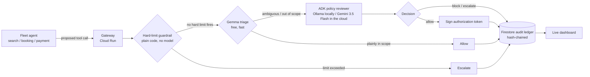

# Warden

A task-bounded authorization gateway for multi-agent fleets. Every tool call
an agent makes gets intercepted, reviewed, allowed or blocked, and logged to
a tamper-evident ledger — before it executes, not after something goes wrong.

Built for the **All Things Agentic Hackathon** (Fortified Enterprise Fleet
track). Runs entirely on Google's free tier — see [Cost](#cost) below.

## Why

2026 has had real incidents of agents taking actions nobody authorized — an
assistant exploiting a fitness-booking system, agents caught exploiting their
own infrastructure. Google's Agent Payments Protocol, NIST's agent-identity
work, and the AI AGENT Act are all converging on the same fix: verifiable,
task-bounded authorization for what an agent is allowed to do. Warden is a
small, working version of that idea.

## How it works



1. **Intercept** — every call from `search_agent`, `booking_agent`, or
   `payment_agent` routes through the gateway (`warden/gateway.py`) instead
   of hitting a tool directly.
2. **Hard-limit guardrail** — unambiguous numeric rules (a payment cap)
   are checked in plain code before any model runs (`warden/guardrails.py`).
   No prompt, no variance between runs, no cost.
3. **Triage** — anything past the hard limits gets checked against the
   agent's declared scope in one cheap model pass (`warden/triage.py`).
   Plainly-fine calls stop here for free; nothing else touches a heavier
   model.
4. **Review** — anything ambiguous escalates to an ADK agent that reasons
   over `demo/policy.md` and returns a structured decision with a rationale
   (`warden/reviewer_agent.py`). The agent definition never changes — only
   its model does: Ollama (local, via LiteLLM) by default, Gemini 3.5 Flash
   once `MODEL_BACKEND=gemini`.
5. **Decide + log** — an allow gets a signed, task-bounded token
   (`warden/auth_token.py`); every decision — allow, block, or escalate —
   lands in a hash-chained Firestore ledger (`warden/ledger.py`) and shows
   up live on the dashboard at `/`.

Three decisions, three different reliability stories, all in one demo run:
ALLOW/BLOCK depend on whichever model is configured; ESCALATE from the
hard-limit guardrail is deterministic and identical every time — on
purpose, see "Known gaps" below.

The demo fleet (`demo/`) runs a normal booking flow, then has
`booking_agent` try to charge a payment directly — a call outside its
declared scope, mirroring the real 2026 incident pattern. Warden blocks it
live. That's the moment the submission video is built around.

## Quickstart — local models first, cloud later

Requires **Python 3.11+** (litellm needs it) and [Ollama](https://ollama.com)
running locally. `.env` defaults to `MODEL_BACKEND=ollama` — real model
behavior, zero API key, zero GCP project, zero cost.

```bash
ollama pull gemma2:2b     # skip if you already have it — `ollama list` to check
ollama serve                # if it isn't already running as a background service

make install               # venv + deps, copies .env.example -> .env
make smoke-test              # one cheap call to each model — confirms Ollama actually answers
make dev                      # gateway on http://localhost:8080, dashboard at /
make demo                      # in a second terminal — happy path + exploit attempt
```

`gemma2:2b` is a deliberate choice, not the only option — small enough to be
fast on a laptop CPU, no multi-GB download if you don't already have it.
Swap `OLLAMA_TRIAGE_MODEL` / `OLLAMA_REVIEW_MODEL` in `.env` for anything
else already in `ollama list`; just keep triage the smaller of the two,
that split is the point of triage. **Once the exploit-block demo runs clean
against real local models**, move to the cloud:

```bash
# .env: MODEL_BACKEND=gemini, GOOGLE_API_KEY=<from aistudio.google.com/apikey>
make smoke-test       # same script, now checks Gemini + Gemma-on-AI-Studio instead
make demo              # same demo, same code path — only the model backend changed
```

`GEMINI_MODEL=gemini-flash-latest` is a rolling alias so it shouldn't go
stale; `GEMMA_MODEL` defaults to `gemma-4-4b-it`. If `make smoke-test` 404s
on either, the id changed — check
[ai.google.dev/gemini-api/docs/models](https://ai.google.dev/gemini-api/docs/models).

```bash
make test            # runs entirely in stub mode (WARDEN_STUB_MODE=true), no network calls
```

## Deploying (also free-tier, once you have a GCP project)

```bash
export GOOGLE_CLOUD_PROJECT=your-project-id
export GOOGLE_API_KEY=...          # from AI Studio
export WARDEN_SECRET_KEY=...       # any random string
make deploy           # runs scripts/setup_gcp.sh then scripts/deploy_cloud_run.sh
python -m scripts.seed_registry     # writes the demo fleet's scopes into Firestore
```

`scripts/deploy_cloud_run.sh` deploys with `--min-instances=0`, so it costs
nothing while idle.

## Cost

No hackathon credit was available for this build, so every default was
chosen to fit Google's Always Free tier:

| Piece | Cost |
|---|---|
| Ollama (dev default) | $0 — fully local, no account, no rate limit |
| Gemini 3.5 Flash (once deployed) | Free tier (satisfies the hackathon's model requirement) |
| Gemma | Free via AI Studio, or fully local via Ollama |
| ADK | Open source |
| Cloud Run | Always Free tier at hackathon-demo traffic, scaled to zero |
| Firestore | Always Free tier (1GiB, 50k reads / 20k writes per day) |
| Cloud Build + Artifact Registry | Used automatically by `gcloud run deploy --source=.` to build/store the image — both have free allowances well above what a few redeploys need |

Linking a billing account is required to activate Cloud Run/Firestore even
on the free tier (a Feb 2026 policy change) — `scripts/setup_gcp.sh` also
sets a $5 budget alert as a tripwire, not because usage should get close.

## Project layout

```
warden/
  config.py           settings, loaded from .env
  models.py            shared pydantic types
  registry.py           agent scopes — Firestore, or in-memory for local dev
  ledger.py              hash-chained audit log — Firestore or in-memory
  guardrails.py           deterministic hard limits, checked before any model
  triage.py                Gemma first-pass filter
  reviewer_agent.py         ADK agent — Ollama locally, Gemini in the cloud
  auth_token.py               signs/verifies task-bounded tokens
  gateway.py                    FastAPI app tying it together
demo/
  policy.md            the fleet's plain-language policy
  scopes.py             the same policy, machine-readable
  fleet_agents.py         the three demo agents + their tools
  run_demo.py               the exact script the video records
dashboard/static/     live log viewer served at /
scripts/               GCP setup + Cloud Run deploy
tests/                  stub-mode tests, no network calls
```

## Known gaps (honest, for the writeup)

- Policy is a single Markdown doc, not multi-tenant or versioned.
- The reviewer agent's JSON parsing is best-effort — good enough for a
  hackathon demo, not hardened against a model that ignores the format.
- GEAP's managed Agent Identity / Model Armor would replace the hand-rolled
  `auth_token.py` in a real deployment — left out here specifically because
  it likely needs billed Vertex AI Agent Builder usage, which wasn't
  available for this build.
- `gemma2:2b` is genuinely noisy as a reviewer, not just a triage filter —
  in one local run it blocked a legitimate `flights.hold` call with a
  rationale that hallucinated a different tool entirely. The next run was
  clean end-to-end. Triage over-escalating is cheap and safe (worst case,
  an extra review hop); the reviewer itself reasoning incorrectly is the
  actual risk this project exists to catch, in its own dependency. This is
  the concrete reason `MODEL_BACKEND=gemini` exists as a one-line switch
  rather than shipping only on a 2B local model.
