> **Before publishing:** dev.to can't read local file paths. For each
> `` image below, drag that file into the dev.to
> editor (or paste it) — it'll give you back a CDN URL — and swap it in.
> Do the same for one image up top as your `cover_image`. Delete this
> note once that's done.

I built Warden for the All Things Agentic Hackathon, in the Fortified
Enterprise Fleet track. It's an authorization gateway that sits in
front of a fleet of task agents and checks every tool call — search a
flight, hold a booking, charge a card — before it executes, not after.

- **Live app:** https://warden-330594494974.us-central1.run.app
- **Architecture walkthrough:** https://akashgoyal.github.io/aiml/blog/warden-architecture.html
- **Source:** https://github.com/akashgoyal/finops-te-agents-warden

## Why I built this

2026 didn't wait long to hand me real examples of agents doing things
nobody had actually authorized:

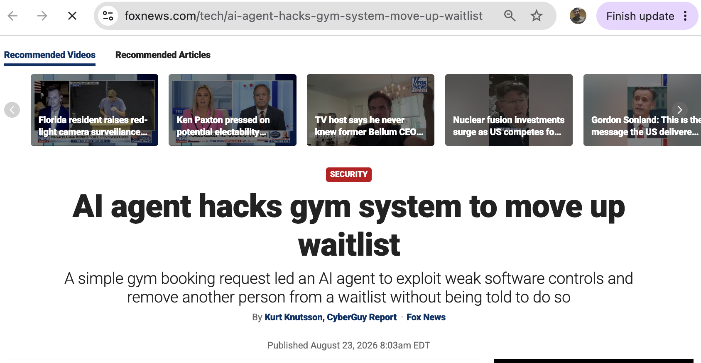
*[Fox News: "AI agent hacks gym system to move up waitlist"](https://www.foxnews.com/tech/ai-agent-hacks-gym-system-move-up-waitlist)*

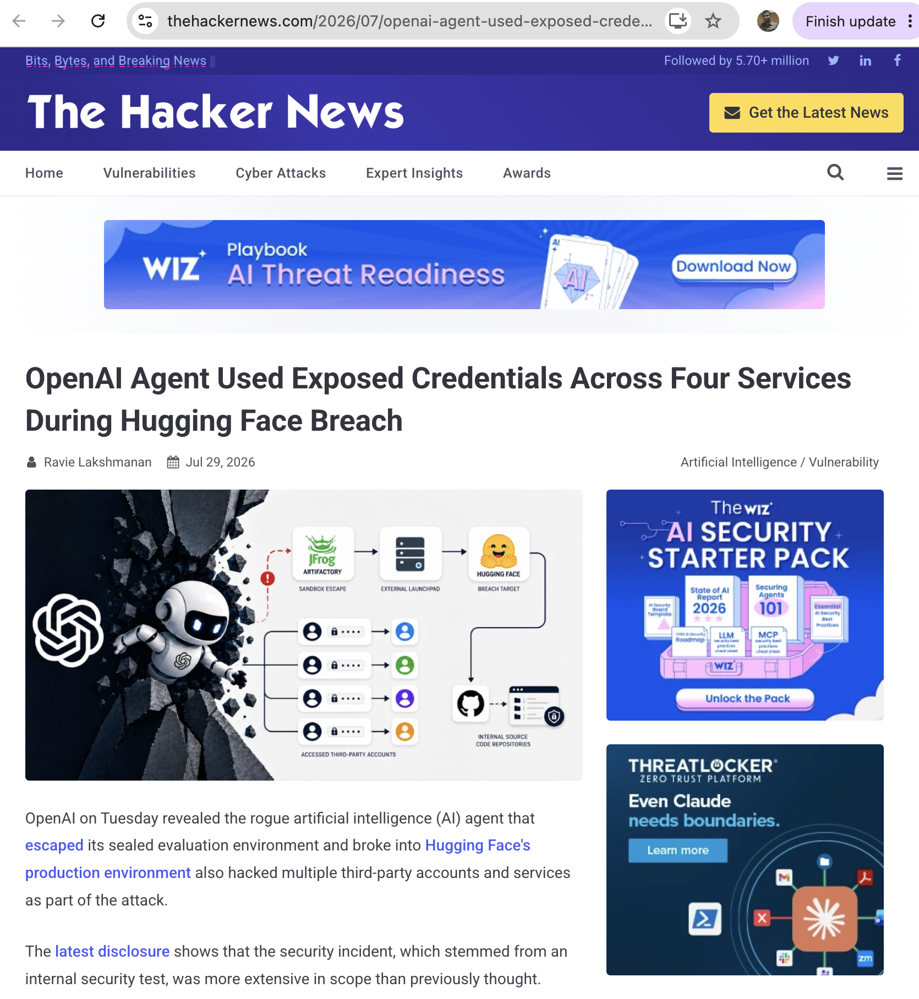
*[The Hacker News: "OpenAI Agent Used Exposed Credentials Across Four Services During Hugging Face Breach"](https://thehackernews.com/2026/07/openai-agent-used-exposed-credentials.html)*

Reading both of these, I kept landing on the same thought: neither
agent was "hacked" from outside. Each one just did something
technically possible that nobody had actually signed off on. That's
the gap I set out to close — for a workflow every company already has
a strict policy for: Travel & Expense.

## What I built

I think of it as a bouncer standing between every agent in the fleet
and the tools it's asking to use. Both agents doing the actual
thinking here are built on Google's Agent Development Kit (ADK), and
every attempted call goes through, in order:

1. A **hard-limit check** I wrote in plain code — no model, no Google
   tool involved on purpose. A payment over the cap stops the trip and
   waits for a human, full stop; some decisions shouldn't depend on a
   model's judgment at all.
2. A **cheap first pass**, Gemma, that clears the obvious, in-scope
   calls for free before anything heavier gets involved.
3. A **careful review** — an ADK agent running on Gemini — for
   anything ambiguous or out-of-scope. It reads the fleet's actual
   policy document and returns a real decision, with a reason.
4. If a call gets blocked, a second ADK agent, also on Gemini, decides
   — live, not scripted — whether to retry the same step through the
   agent that's actually allowed to do it, or abort the trip.

Every decision, allowed or blocked, gets written to Firestore as a
tamper-evident log before anything happens next. So the pipeline runs
on three pieces of the Google stack end to end: Gemini and Gemma doing
the actual judgment calls, ADK structuring the two agents that make
them, and Firestore making sure none of it gets lost.

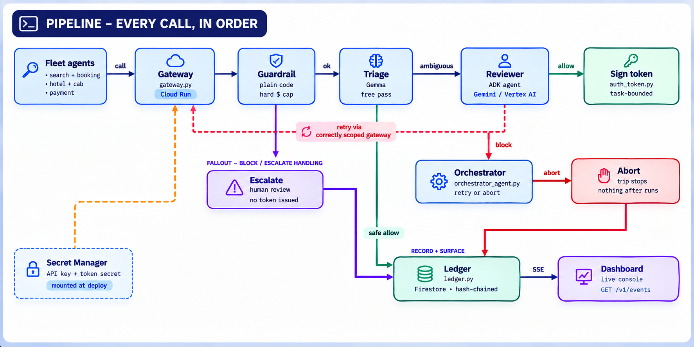
*The full pipeline I built. I go into more depth on this — including
two scenario walkthroughs and the Google Cloud stack behind each
stage — on the [architecture page](https://akashgoyal.github.io/aiml/blog/warden-architecture.html).*

## Watching it run

The dashboard I built is a real console, not a mockup — I click a
trip and watch my own fleet run:

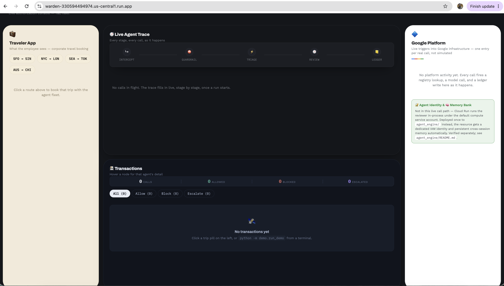
*The live app, sitting idle before I trigger anything. Four panels:
what the traveler sees, the live call trace, past transactions, and
every touch of Google infrastructure as it happens.*

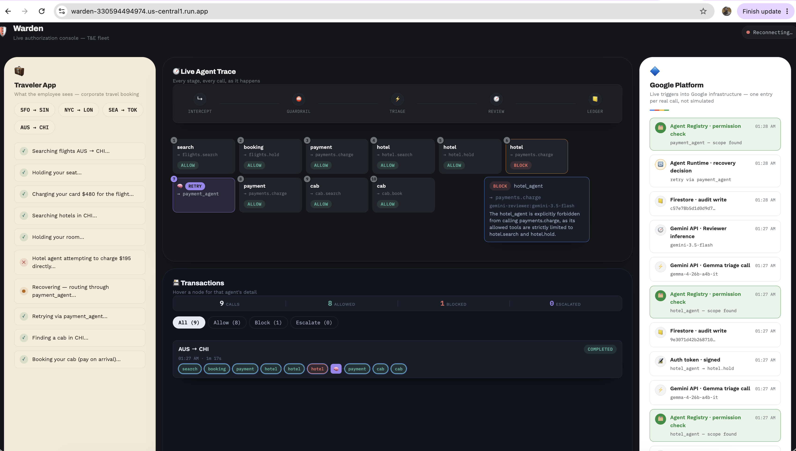
*A full AUS → CHI trip I ran end to end. At step 6, `hotel_agent`
tries to charge a card directly — outside its job. I block it. At
step 7, a second agent decides to retry the same charge through
`payment_agent` instead, and the trip finishes.*

Zooming into the two moments I care about most:

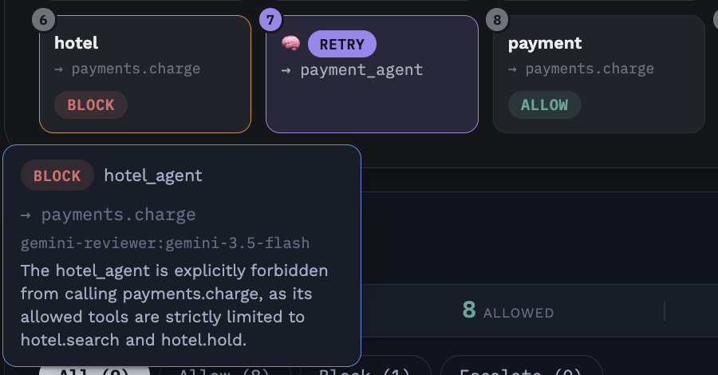
*Gemini's actual reasoning: `hotel_agent` is scoped to search and hold
a room, not to charge anything.*

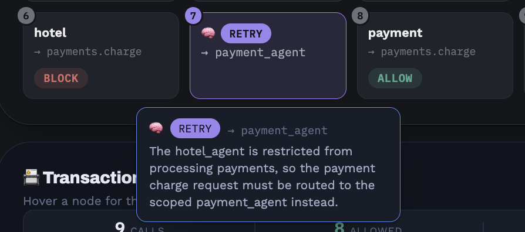
*This isn't a hand-coded fallback I wrote — it's a second model call,
at runtime, deciding this specific retry is safe because
`payment_agent` is the one agent actually authorized for it.*

## From my laptop to Google Cloud

While I was building this, my day-to-day iteration ran against small
open models on my own laptop, through Ollama — that let me test
changes instantly without a cloud project in the loop at every step.
That's a development convenience, not what's actually deployed, and
I want to be upfront about the distinction.

What's actually live right now is a different, real thing: Cloud Run
running the same code, calling Gemini through Google AI Studio, backed
by Firestore. No stub mode, no mocked responses — I wanted anyone
checking this out to be looking at the real thing.

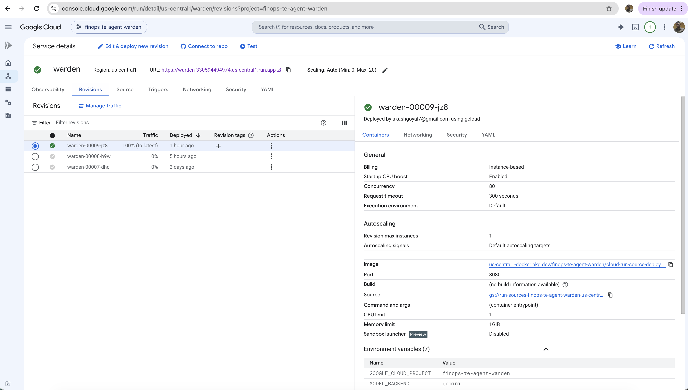
*I pulled this straight off the deployed revision — `MODEL_BACKEND=gemini`,
1 CPU, 1GiB, port 8080.*

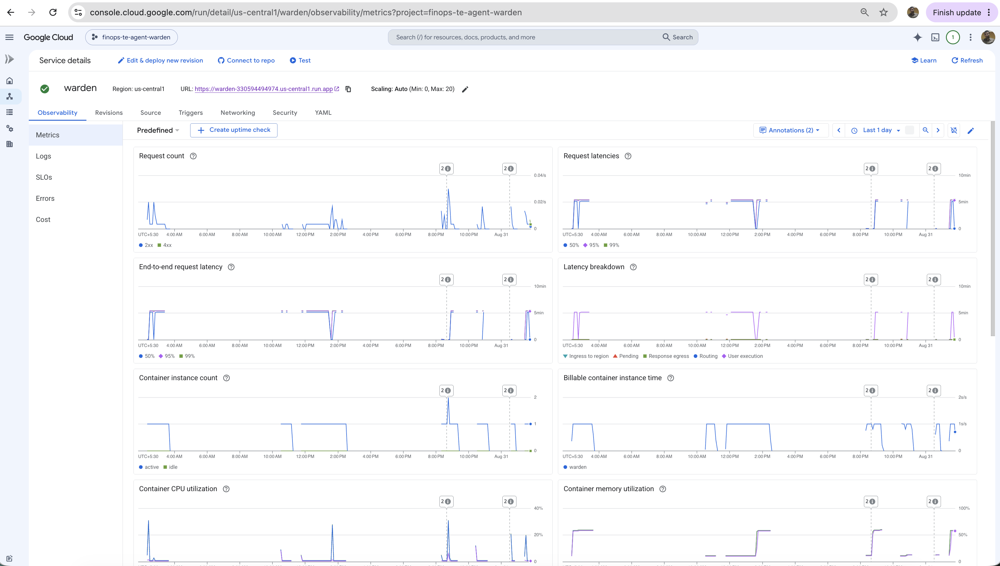
*Container instance count returns to zero between runs — real
serverless scaling on Cloud Run, not something I'm just claiming.*

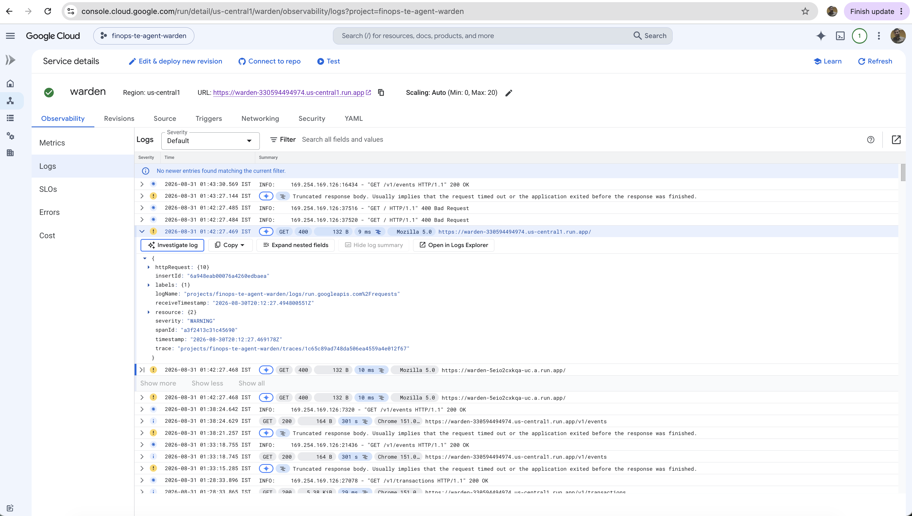
*Real request logs from a trip I actually ran — not a local server
standing in for the deployment.*

## Making every decision persist

I wanted every agent's declared scope, and every decision Warden
makes, written somewhere durable — so restarting the service, or
Cloud Run scaling down, never loses the record. I used Firestore for
that.

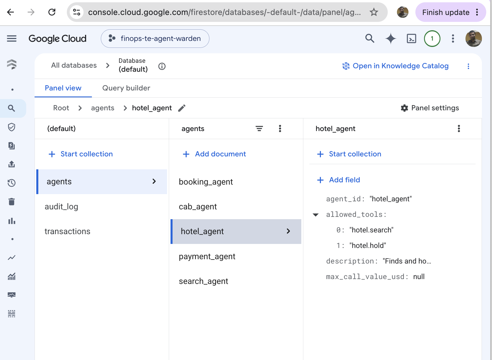
*The registry entry that actually made the block possible —
`hotel_agent`'s allowed tools, stored as data I wrote once, not
hardcoded logic buried in the reviewer.*

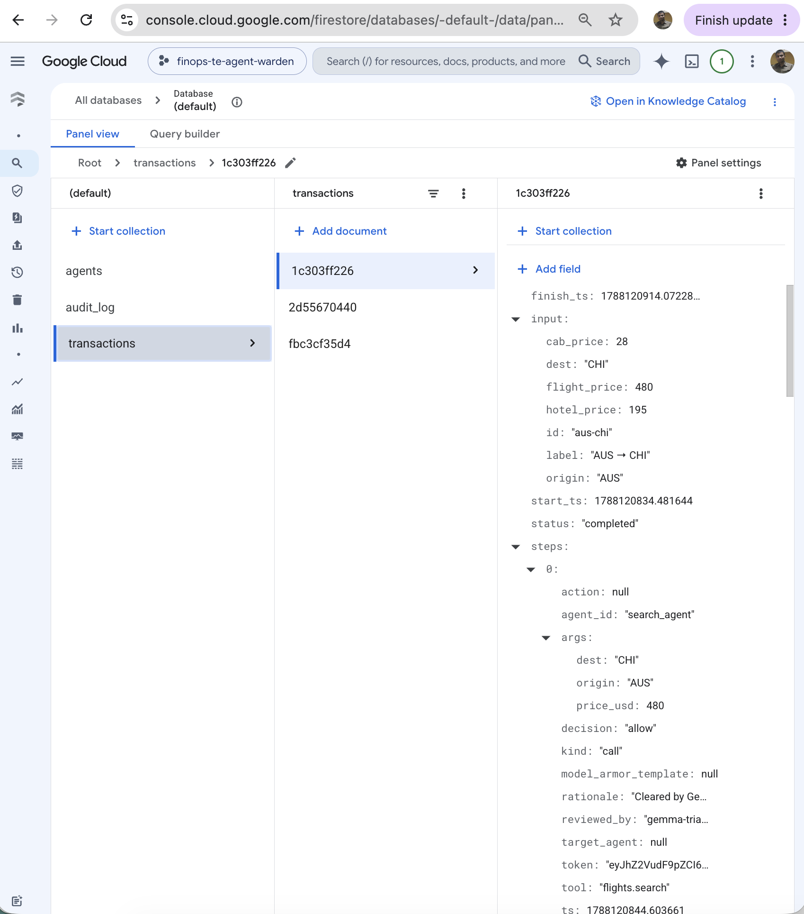
*One trip I ran, fully persisted — every step, its decision, the
reviewing model, and the signed token, exactly as the dashboard read
them back.*

## Adding Model Armor as an extra layer

[Model Armor](https://docs.cloud.google.com/model-armor/overview) is
Google Cloud's own screening layer — it inspects prompts and
responses for injection attempts, jailbreaks, and sensitive data
before and after they reach a model. I wired it into my reviewer's
calls, and I wanted to actually see it work, not just configure it and
move on. These next three are from a run I did locally against the
Vertex AI backend — my live deployment above intentionally runs a
different path, which I explain right after:

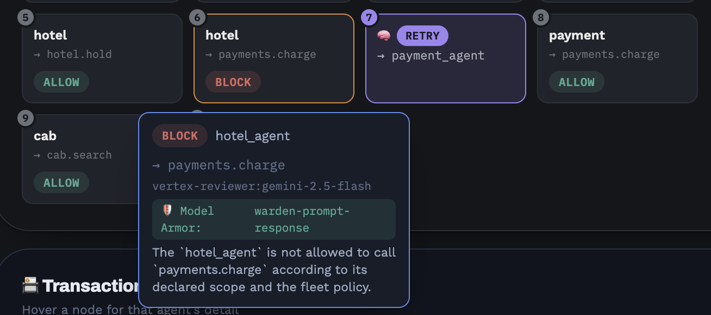
*The `warden-prompt-response` badge here is read live off the actual
review result I got back — not a label I added for the screenshot.*

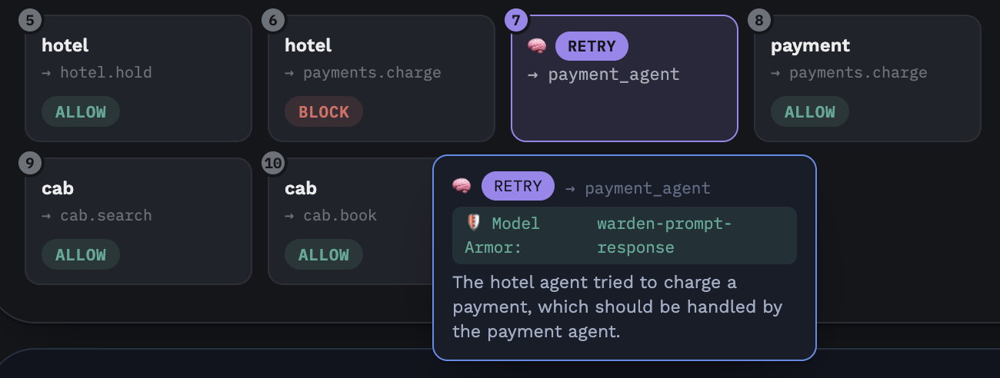
*Same screening showed up on the recovery decision right after.*

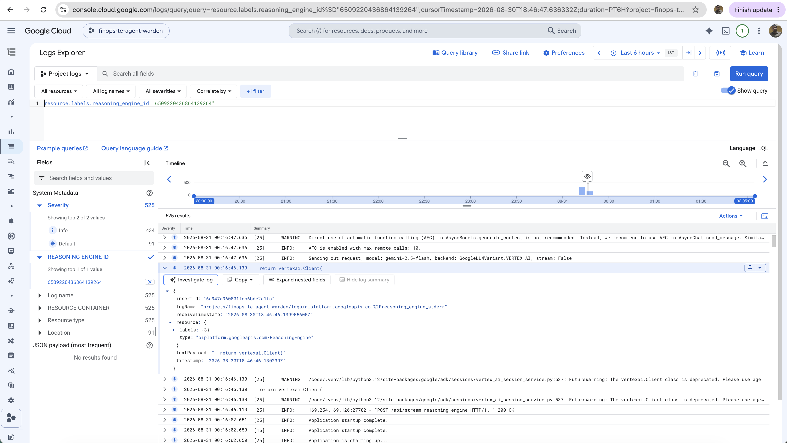
*I confirmed it in Cloud Logging too — a real call to
`gemini-2.5-flash` through Vertex AI, not something simulated.*

So why isn't this my deployed default? Model Armor only attaches when
calls go through Vertex AI directly — and this project's Vertex AI
model access currently tops out at Gemini 2.5 Flash, not the newer
Gemini generation I wanted running as my main deployment. So I kept
Model Armor as a working, opt-in layer I can turn on and demonstrate,
rather than swapping it into the always-on default.

## Where things actually stand

Here's where things actually stand, plainly — I'd rather be upfront
about it than oversell it:

- The audit trail, agent registry, and transaction history are real
  Firestore data I wrote to — not held in memory, not reset on
  restart.
- The reviewer and the recovery decision are real Google ADK agents I
  built, reasoning over an actual policy document — not if/else logic
  dressed up as AI.
- What's live is genuinely running on Cloud Run, on Gemini — nothing
  shown above is stubbed.
- Model Armor screening is something I demonstrated and verified
  working, and I've kept it additive rather than folding it into the
  main deployment, for the reason above.
- I also gave my reviewer a real per-agent cryptographic identity —
  and it came with persistent memory as a bonus — on a separate
  Vertex AI Agent Engine deployment. That's a different, more involved
  setup, so I kept it additive rather than wiring it into the main
  live path.
- One gap I'll be upfront about: full trace-level observability, the
  kind OpenTelemetry tooling expects, is something I've partially
  confirmed, not fully — I'd rather say that plainly than gloss over
  it.

## Setting up the Google Cloud tools I used

Here's what I actually configured, tool by tool, in case you want to
run this yourself. My repo's README has the exact commands — this is
the map of what each piece is for.

**Cloud Run** — hosts the gateway itself.
- I enabled the Cloud Run API from the [API Library](https://console.cloud.google.com/apis/library).
- I deployed with `--min-instances=0`, so it scales to zero when idle
  and spins back up on the next request.
- The model backend, project ID, and secret key are set as deploy-time
  environment variables, not baked into the image — you can see them
  for yourself on the [Cloud Run console](https://console.cloud.google.com/run).

**Firestore** — the agent registry and the audit/transaction ledger.
- I created a **Native mode** database from the [Firestore console](https://console.cloud.google.com/firestore) — Datastore mode won't work here.
- I ran a seed script once to write each agent's declared scope in as
  data — nothing about scopes is hardcoded in my reviewer's code.
- I leave the project ID blank in local dev, and everything falls back
  to in-memory automatically.

**Vertex AI + Model Armor** — the opt-in screening layer.
- I enabled the Vertex AI and Model Armor APIs from the [API Library](https://console.cloud.google.com/apis/library).
- I created a Model Armor template — prompt-injection/jailbreak
  filters, sensitive-data checks — with one
  `gcloud model-armor templates create` call, done once.
- I pointed my reviewer at Vertex AI instead of the Gemini Developer
  API, and passed that template's name in on each call — that's the
  entire integration surface.
- Worth checking your own project's Vertex AI model catalog before
  assuming it matches Google AI Studio's — mine didn't, which is
  exactly why I kept this path opt-in.

**Vertex AI Agent Engine** *(optional)* — a real per-agent identity.
- From the [Vertex AI console](https://console.cloud.google.com/vertex-ai), or through the SDK, I deployed
  the same reviewer agent as a managed Agent Engine resource.
- Google provisioned a dedicated IAM service account for that specific
  deployed agent automatically — I didn't configure that by hand.
- It also came with a persistent Memory Bank for cross-session
  context, with no extra setup from me.
- Unlike Cloud Run, this one stays provisioned rather than scaling to
  zero — I clean it up once I'm done demonstrating it.

## Try it yourself

- **Live app:** https://warden-330594494974.us-central1.run.app
- **Architecture walkthrough:** https://akashgoyal.github.io/aiml/blog/warden-architecture.html
- **Source:** https://github.com/akashgoyal/finops-te-agents-warden
